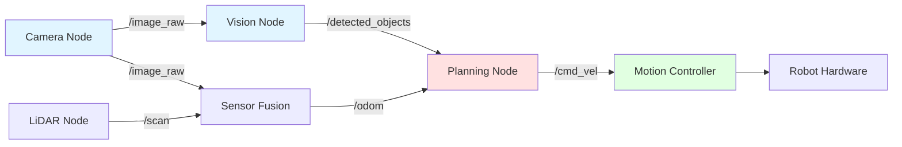
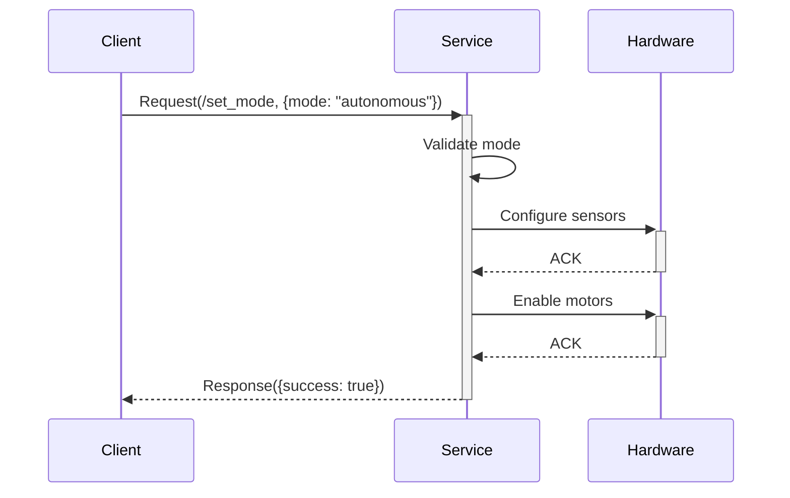
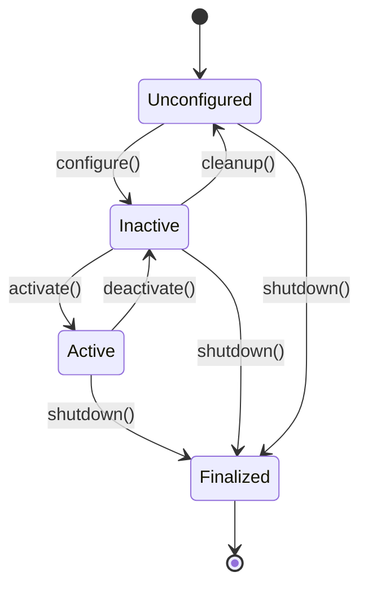
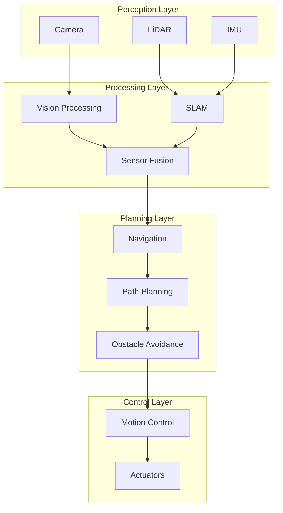
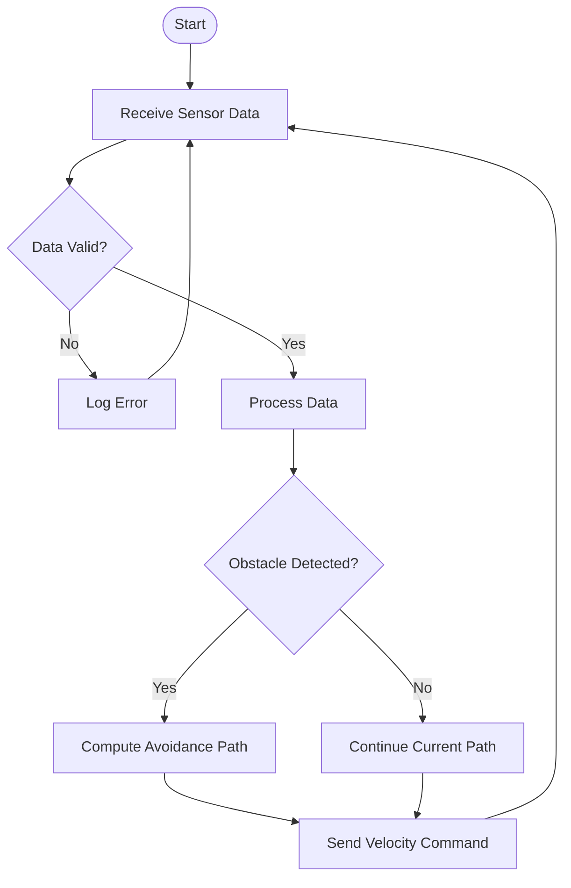
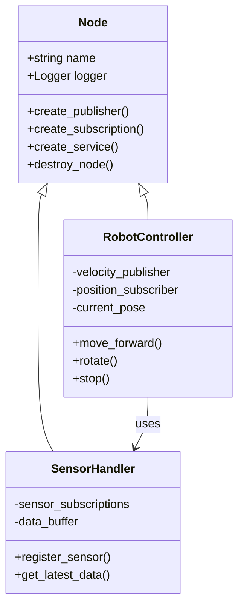

# Diagram Generator Skill

## Description
Creates Mermaid diagrams for robotics architectures, workflows, and system designs that can be embedded directly in Markdown documentation.

## Usage
Invoke when you need visual representations of:
- ROS 2 node architectures
- Communication patterns (topics, services, actions)
- System workflows
- State machines
- Sequence diagrams
- Class hierarchies

## Input
Describe the system or process to visualize:
- Type of diagram needed (flowchart, sequence, class, state, architecture)
- Components and their relationships
- Data flow direction
- Key interactions

## Output Types

### 1. ROS 2 Architecture Diagram


### 2. Sequence Diagram (Service Call)


### 3. State Machine (Lifecycle Node)


### 4. System Architecture (Multi-Level)


### 5. Flowchart (Algorithm)


### 6. Class Diagram (OOP Structure)


## Best Practices
- ✅ Use descriptive node/edge labels
- ✅ Apply consistent styling (colors for component types)
- ✅ Include direction arrows for data flow
- ✅ Group related components in subgraphs
- ✅ Keep diagrams readable (max 10-15 nodes)
- ✅ Use standard ROS 2 naming conventions

## Styling Guide
```
- Perception nodes: Light blue (#e1f5ff)
- Processing nodes: Light yellow (#fff4e1)
- Planning nodes: Light red (#ffe1e1)
- Control nodes: Light green (#e1ffe1)
- Data topics: Solid arrows
- Service calls: Dashed arrows
- Actions: Thick arrows
```

## Example Invocations

**Input**: "Diagram showing a ROS 2 navigation stack with SLAM, path planning, and obstacle avoidance"

**Output**: Multi-layer architecture diagram with sensor inputs, processing nodes, and actuator outputs.

**Input**: "Sequence diagram for a robot arm pick-and-place task with vision and motion planning"

**Output**: Detailed sequence showing camera capture → object detection → motion planning → grasp execution.

## Integration with Docusaurus
All diagrams are Mermaid-compatible and render automatically in Docusaurus markdown files. Just paste the code block with triple backticks and `mermaid` language tag.
